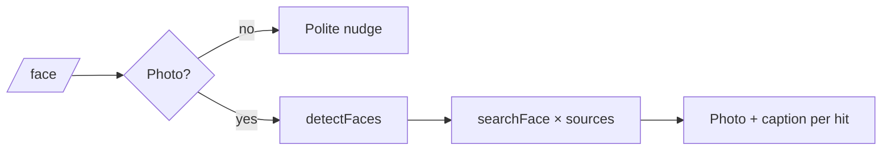

# Tele4Faces

<pre align="center">
╔══════════════════════════════════════╗
║   FACE  →  JSON-RPC  →  TELEGRAM     ║
╚══════════════════════════════════════╝
</pre>

This repo is a **small science experiment**: one Telegram bot, one remote face index 

---

## What actually happens (field notes)

1. You say **`/start`**. The bot introduces itself like a polite lab assistant.
2. You say **`/face`**. The bot asks for a **photo** (or an image **document**).
3. The bot sends the bytes to **search4faces** as **base64** (`detectFaces`), keeps the server-side **`image` id**, picks the **largest** bounding box if several faces exist, then fans out **`searchFace`** calls across the **`source`** databases you configure.
4. For each distinct hit, Telegram receives the **thumbnail** (`profile["face"]`) with an **HTML caption**: profile link, score, rough identity fields when the API returns them.



---

   

```bash
python -m venv .venv
.venv\Scripts\activate          # Windows
# source .venv/bin/activate     # macOS / Linux
pip install -r requirements.txt
copy env.example .env         # then edit .env — Windows
# cp env.example .env         # Unix
python tele4faces.py
```

**No Search4Faces key?** Leave `SEARCH4FACES_API_KEY` empty (or keep `MOCK_API=true`). The bot still runs: it serves **deterministic-looking fake matches** so you can test Telegram flows without spending quota.

---

## Environment variables (recipe card)

| Variable | Required | Default vibe |
|----------|----------|--------------|
| `TELEGRAM_BOT_TOKEN` | yes | BotFather token (`123456:ABC…`). `TELEGRAM_TOKEN` alias also works. |
| `SEARCH4FACES_API_KEY` | for real searches | Empty ⇒ **mock mode** unless you force otherwise. |
| `MOCK_API` | no | `true` / `1` forces mock even if a key is present. |
| `SEARCH_SOURCES` | no | Comma list; falls back to all documented sources in code. |
| `RESULTS_PER_SOURCE` | no | `5` (clamped 1–50). |
| `SOURCE_DELAY_SEC` | no | `0.35` — cheap guardrail between sources. |
| `SEARCH_LANG` | no | `en` |
| `INCLUDE_HIDDEN_PROFILES` | no | `true` |
 
---

## Ethics & safety (non-negotiable)

- **Consent**: only process images you are allowed to process.
- **False positives**: similarity scores are not courtroom evidence.
- **Abuse**: if you expose this bot publicly, add your own throttling, logging, and moderation.

---

## API references

- [search4faces API](https://search4faces.com/api.html)  
- [JSON-RPC 2.0](https://www.jsonrpc.org/specification)  
- [Python example archive](https://search4faces.com/api_test_py.zip) (upstream sample; this repo reimplements the flow with mock mode and Telegram UX)

---
 
