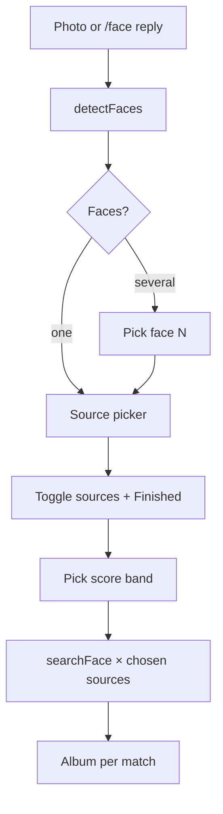

# Tele4Faces


Telegram bot that sends a face photo through **[search4faces.com](https://search4faces.com/)** and returns **public-profile** lookalikes with rich captions and a **two-photo album** per hit (match **+** your original upload).

---

## What it does

| Step | Behavior |
|------|-----------|
| **1. Photo in** | Send **any photo** (or **reply `/face`** to an old photo). No warm-up command required. |
| **2. Detect** | One `detectFaces` call — base64 image, get server `image` id + face box(es). |
| **3. Multi-face** | Several faces → inline **Face 1 / Face 2 / …**; one face → straight to sources. |
| **4. Pick databases** | **Multi-select** inline keys (☐ / ✅), then **✔️ Finished**. |
| **5. Confidence** | Choose **80–100%**, **60–100%**, or **40–100%** (filters API scores client-side). |
| **6. Search** | One `searchFace` per **checked** source — saves quota vs blasting every index. |
| **7. Results** | Each match = **media group**: (1) API face thumbnail with HTML caption, (2) **your full original photo** for side-by-side comparison. |



---
## Prerequisites

- **Python 3.10+** (3.14 on Windows may lack Pillow wheels; bot still runs; optional face helpers degrade gracefully).
- **Telegram bot token** ([@BotFather](https://t.me/BotFather)).
- **Search4Faces API key** for live search ([API & contact](https://search4faces.com/api.html)).

---

## Quick start (local)

```bash
git clone https://github.com/AlexRabbit/Search4Faces_Telegram.git
cd Search4Faces_Telegram
python -m venv .venv
```

**Windows**

```bat
.venv\Scripts\activate
pip install -r requirements.txt
copy env.example .env
notepad .env
python tele4faces.py
```

**Linux / macOS**

```bash
source .venv/bin/activate
pip install -r requirements.txt
cp env.example .env
nano .env
python tele4faces.py
```

Fill `.env` with `TELEGRAM_BOT_TOKEN` and `SEARCH4FACES_API_KEY` (or leave key blank for mock behaviour).

---

## Deploy 24/7 (Linux VPS)

Example: Ubuntu, app in `/opt/Search4Faces_Telegram`.

```bash
sudo apt update && sudo apt install -y git python3 python3-venv python3-pip
cd /opt
sudo git clone https://github.com/AlexRabbit/Search4Faces_Telegram.git
cd Search4Faces_Telegram
python3 -m venv .venv
source .venv/bin/activate
pip install --upgrade pip
pip install -r requirements.txt
cp env.example .env && nano .env   # add secrets
```

**systemd** — `/etc/systemd/system/tele4faces.service`:

```ini
[Unit]
Description=Search4Faces Telegram bot
After=network-online.target
Wants=network-online.target

[Service]
Type=simple
WorkingDirectory=/opt/Search4Faces_Telegram
Environment=PYTHONUNBUFFERED=1
ExecStart=/opt/Search4Faces_Telegram/.venv/bin/python /opt/Search4Faces_Telegram/tele4faces.py
Restart=on-failure
RestartSec=15

[Install]
WantedBy=multi-user.target
```

Then:

```bash
sudo systemctl daemon-reload
sudo systemctl enable --now tele4faces.service
sudo journalctl -u tele4faces.service -f
```


---

## Environment variables

| Variable | Required | Notes |
|----------|----------|--------|
| `TELEGRAM_BOT_TOKEN` | **yes** | BotFather token. Alias: `TELEGRAM_TOKEN`. |
| `SEARCH4FACES_API_KEY` | for live API | Empty / placeholder → mock responses. |
| `MOCK_API` | no | `true` forces mock even if a key is set. |
| `API_RESULTS_FETCH` | no | Default **10** (clamped 5–30) per `searchFace`. |
| `SOURCE_DELAY_SEC` | no | Default **1** s between sources. |
| `SEARCH4FACES_API_URL` | no | Override JSON-RPC URL if needed. |
| `SEARCH_LANG` | no | Default `en` (see API for `ru`, etc.). |
| `INCLUDE_HIDDEN_PROFILES` | no | Default `true`. |
| `TELE4FACES_NO_AUTO_PIP` | no | Set `1` to skip auto `pip install` in `tele4faces.py`. |

---

## Ethics & safety

- Process only images you are **allowed** to process.
- Similarity scores are **not** proof of identity.
- If the bot is public, add **rate limits**, logging, and abuse handling yourself.

---

## API references

- [search4faces API](https://search4faces.com/api.html)
- [JSON-RPC 2.0](https://www.jsonrpc.org/specification)
- [Python sample (upstream)](https://search4faces.com/api_test_py.zip)

---
